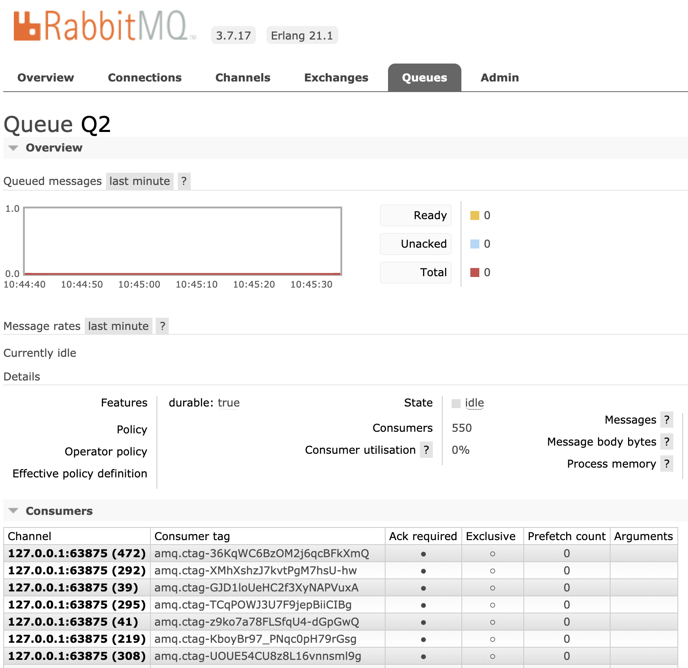

# Rabbit Consumer

## Overview

An application used to spin up multiple AMQP consumers on a target queue.

Custom processing of messages may be carried out through implementation of **hooks**. This is optional.

## Usage

Download and extract a `rabbitmq_consumer` installation package and use/execute as follows:

```
$ export RABBITMQ_CONSUMER_HOST=127.0.0.1
$ export RABBITMQ_CONSUMER_PORT=5672
$ export RABBITMQ_CONSUMER_VHOST=/
$ export RABBITMQ_CONSUMER_USERNAME=admin
$ export RABBITMQ_CONSUMER_PASSWORD=admin
$ export RABBITMQ_CONSUMER_QUEUE=Q2
$
$ ./bin/rabbitmq_consumer daemon
$ ./bin/rabbitmq_consumer remote
Erlang/OTP 21 [erts-10.1] [source] [64-bit] [smp:12:12] [ds:12:12:10] [async-threads:1] [hipe]

Interactive Elixir (1.9.0) - press Ctrl+C to exit (type h() ENTER for help)
iex(rabbitmq_consumer@ayandas-mac)1> Rabbit.Consumer.consume 455
:ok
iex(rabbitmq_consumer@ayandas-mac)2> Rabbit.Consumer.consume 95
:ok
iex(rabbitmq_consumer@ayandas-mac)3> Rabbit.Consumer.stop
:ok
iex(rabbitmq_consumer@ayandas-mac)4> Rabbit.Consumer.consume 112
:ok
iex(rabbitmq_consumer@ayandas-mac)5>

```

This will result in multiple consumers created for the specific, configured queue. The RabbitMQ Management intercafe will illustrate the following:

<p style="text-align:center"></p>
<p style="text-align:center"><b>Rabbit Consumer</b>
</p>

## Hooks

To introduce custom processing of consumed messages, hooks may be implemented with a `forward/1` function which takes a single parameter, which is the consumed delivery message, and returns `:ok` on successful message forwarding or processing.

The following `Rabbit.Consumer.Dummy.Hook` is an example of a consumer hook. This hook does nothing but simply ignore the consumed message and returns the mandatory `:ok` term.

```elixir
defmodule Rabbit.Consumer.Dummy.Hook do
  @moduledoc """
    Documentation for Rabbit Consumer Dummy Hook callback.
  """
  require Logger

  use Rabbit.Consumer.Hook

  @spec forward(Rabbit.Consumer.Hook.delivery_message_t) :: :ok
  def forward(_message = {:basic_deliver, _payload, %{delivery_tag: _tag}}) do
    # process or forward message ...
    :ok
  end

end
```

## Configuration

The Rabbit Consumer is configured as follows in `config.exs`:

```
config :rabbitmq_consumer, :hook,
  Rabbit.Consumer.Dummy.Hook

config :rabbitmq_consumer, :config,
  host: "localhost",
  port: 5672,
  virtual_host: "/",
  username: "admin",
  password: "admin",
  queue: "TEST-QUEUE-1"
```

Or, it may be configured as host environment variables as follows:

```
$ export RABBITMQ_CONSUMER_HOST=127.0.0.1
$ export RABBITMQ_CONSUMER_PORT=5672
$ export RABBITMQ_CONSUMER_VHOST=/
$ export RABBITMQ_CONSUMER_USERNAME=admin
$ export RABBITMQ_CONSUMER_PASSWORD=admin
$ export RABBITMQ_CONSUMER_QUEUE=Q2
```

**NOTE:** WThe active hook to use may also be configured as an environment variable, `RABBITMQ_CONSUMER_HOOK`, however, with caution to **always** postfix the hook name with the term `Elixir.`. For example, configuring the `Rabbit.Consumer.Dummy.Hook` as an environment variable would be carried out as follows:

```
export RABBITMQ_CONSUMER_HOOK=Elixir.Rabbit.Consumer.Dummy.Hook
```

Each hook is an implementaion of the `Rabbit.Consumer.Hook.Behaviour` pattern.


## Installation


```elixir
def deps do
  [
    {:rabbitmq_consumer, "~> 0.1.0"}
  ]
end
```


